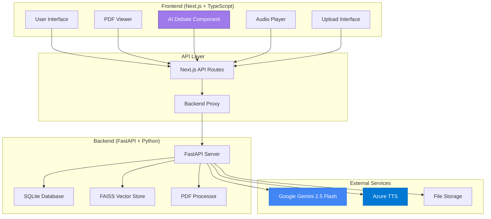

# 📚 Document Insight System

An AI-powered document analysis platform that transforms your research documents into interactive insights, complete with AI expert debates and audio summaries.


**Adobe Embed Api Key = c86390c34abf4eb99411b76d434d55bf**

## ✨ Features

### � **Intelligent Document Analysis**
- **PDF Upload & Processing**: Bulk upload and fresh document parsing
- **Semantic Search**: FAISS-powered vector similarity search
- **Text Selection**: Interactive document reader with selection capabilities
- **Related Content Discovery**: Find connections across your document library

### 🧠 **AI-Powered Insights**
- **Multi-Perspective Analysis**: Generate related, overlapping, contradictory insights
- **Example Extraction**: Discover practical applications and case studies
- **Contextual Understanding**: AI analyzes content relationships across documents

### 🎭 **AI Expert Debate (EXCLUSIVE)**
- **Three AI Personalities**: 
  - 🔬 **The Skeptical Researcher** - Critical analysis and methodology questioning
  - 🚀 **The Optimistic Innovator** - Breakthrough potential and opportunities
  - 📊 **The Data-Driven Analyst** - Statistical evidence and objective evaluation
- **Multi-Round Discussions**: Dynamic debate format with rebuttals
- **Audio Playback**: Individual segment or full debate audio with pause/play controls
- **Sequential Audio**: "Play All" functionality for complete debate experience
- **Transcript Download**: Export debate transcripts for reference

### 🎵 **Audio Generation**
- **Azure TTS Integration**: High-quality speech synthesis
- **Multiple Voice Profiles**: Distinct voices for different AI personas
- **Podcast Mode**: Convert insights into engaging audio content
- **Individual Segment Control**: Play, pause, or stop any debate segment

### 💾 **Data Management**
- **FAISS Vector Storage**: Efficient similarity search and retrieval
- **SQLite Metadata**: Document information and relationship storage
- **File Management**: Organized upload and storage system

## 🚀 Quick Start

### Prerequisites

- **Node.js** 18+ and **pnpm**
- **Python** 3.8+
- **Azure Speech Services** account (for audio generation)
- **Google AI API** key (for Gemini models)

### Installation

1. **Clone the repository**
   ```bash
   git clone https://github.com/DikshaKhandelwal/document-insight-system.git
   cd document-insight-system
   ```

2. **Install frontend dependencies**
   ```bash
   pnpm install
   ```

3. **Install backend dependencies**
   ```bash
   cd backend
   pip install -r requirements.txt
   ```

4. **Set up environment variables**
   Create a `.env` file in the `backend` directory:
   ```env
   # Google AI API
   GOOGLE_API_KEY=your_google_api_key_here
   GEMINI_MODEL=gemini-2.0-flash-exp
   
   # Azure Speech Services
   AZURE_TTS_KEY=your_azure_speech_key
   AZURE_TTS_ENDPOINT=https://your-region.tts.speech.microsoft.com/
   
   # Optional: Custom configurations
   EMBEDDING_MODEL=all-MiniLM-L6-v2
   MAX_FILE_SIZE=10485760
   SIMILARITY_THRESHOLD=0.7
   ```

### Running the Application

1. **Start the backend server**
   ```bash
   cd backend
   uvicorn main:app --reload --port 8000
   ```

2. **Start the frontend development server**
   ```bash
   pnpm dev
   ```

3. **Open your browser**
   Navigate to `http://localhost:3001`

## 🏗️ Architecture

### System Overview



### Data Flow Architecture

```
┌─────────────────┐    ┌─────────────────┐    ┌─────────────────┐
│   User Upload   │───▶│  PDF Processing │───▶│  Vector Index   │
│   (PDF Files)   │    │   (PyMuPDF)     │    │    (FAISS)      │
└─────────────────┘    └─────────────────┘    └─────────────────┘
                                │
                                ▼
┌─────────────────┐    ┌─────────────────┐    ┌─────────────────┐
│   Text Search   │◀───│  Text Selection │───▶│   AI Analysis   │
│   (Semantic)    │    │   (Frontend)    │    │   (Gemini)      │
└─────────────────┘    └─────────────────┘    └─────────────────┘
                                │                       │
                                ▼                       ▼
┌─────────────────┐    ┌─────────────────┐    ┌─────────────────┐
│  Audio Player   │◀───│   AI Debate     │◀───│   Insights      │
│  (Individual/   │    │  (3 Personas)   │    │  Generation     │
│   Sequential)   │    │                 │    │                 │
└─────────────────┘    └─────────────────┘    └─────────────────┘
         │                       │
         ▼                       ▼
┌─────────────────┐    ┌─────────────────┐
│   Azure TTS     │    │   Transcript    │
│ (Multi-Voice)   │    │   Download      │
└─────────────────┘    └─────────────────┘
```

### Component Interaction Flow

```
User Action Flow:
1. Upload PDF → 2. Process & Index → 3. Select Text → 4. Generate Insights
                                                          ↓
8. Download ← 7. Play Audio ← 6. Create Debate ← 5. AI Analysis

Audio Generation Flow:
Text Input → Gemini Script → Voice Mapping → Azure TTS → Audio File → Player

AI Debate Flow:
Selected Text → Context Analysis → 3 AI Personas → Multi-Round Discussion → Audio + Transcript
```

### Frontend (Next.js + TypeScript)
```
app/
├── page.tsx                 # Main application interface
├── reader/                  # PDF viewer and document reader
├── api/                     # API route handlers
│   ├── audio/              # Audio generation endpoints
│   ├── documents/          # Document management
│   ├── insights/           # AI insights generation
│   ├── search/             # Semantic search
│   └── upload/             # File upload handling
└── globals.css             # Global styles

components/
├── ai-debate.tsx           # AI Expert Debate component
├── audio-player.tsx        # Audio playback controls
├── pdf-viewer.tsx          # Document viewer
├── upload-area.tsx         # File upload interface
└── ui/                     # Reusable UI components
```

### Backend (FastAPI + Python)
```
backend/
├── main.py                 # FastAPI application and all endpoints
├── requirements.txt        # Python dependencies
└── data/
    ├── documents.db        # SQLite database
    ├── uploads/           # Uploaded PDF files
    └── audio/             # Generated audio files
```
## 🎯 Core Components

### AI Expert Debate System
The crown jewel of the application - an innovative AI debate feature that creates engaging discussions between three distinct AI personalities:

**Key Features:**
- **Gemini 2.0 Flash Integration**: Latest AI model for sophisticated reasoning
- **Multi-Voice Audio**: Azure TTS with distinct voice profiles
- **Interactive Playback**: Individual segment control and sequential playback
- **Transcript Export**: Professional debate transcripts with timestamps

### Document Processing Pipeline
1. **Upload**: PDF files processed and stored
2. **Extraction**: Text content extracted with metadata
3. **Vectorization**: Content embedded using sentence transformers
4. **Indexing**: FAISS vector index for similarity search
5. **Analysis**: AI-powered insight generation

### Audio Generation System
- **Script Generation**: AI creates conversational content
- **SSML Processing**: Speech Synthesis Markup Language for natural speech
- **Voice Mapping**: Different voices for different AI personas
- **File Management**: Organized audio file storage and retrieval

## 🔧 API Endpoints

### Document Management
- `POST /upload` - Upload PDF documents
- `GET /documents` - List all documents
- `GET /search` - Semantic search across documents

### AI Features
- `POST /insights` - Generate AI insights for selected text
- `POST /ai-debate` - Create AI expert debate
- `POST /audio` - Generate audio content

### Utilities
- `GET /locate` - Find text in documents
- `GET /api/audio/{filename}` - Serve audio files
- `GET /api/ai-debate/download/{debateId}` - Download debate transcripts

## 🎨 Tech Stack

### Frontend
- **Next.js 14** - React framework with App Router
- **TypeScript** - Type-safe development
- **Tailwind CSS** - Utility-first styling
- **Radix UI** - Accessible component library
- **Lucide React** - Icon library

### Backend
- **FastAPI** - Modern Python web framework
- **SQLite** - Lightweight database
- **FAISS** - Vector similarity search
- **Sentence Transformers** - Text embeddings
- **PyMuPDF** - PDF processing
- **Azure Cognitive Services** - Text-to-speech
- **Google Generative AI** - Gemini models

### AI & ML
- **Gemini 2.0 Flash** - Advanced language model
- **Azure Speech Services** - High-quality TTS
- **FAISS** - Efficient vector search
- **Sentence Transformers** - Semantic embeddings

## 📈 Usage Examples

### 1. Document Analysis Workflow
1. Upload your research PDFs
2. Select interesting text passages
3. Generate AI insights (related, contradictory, examples)
4. Create audio summaries or debates

### 2. AI Expert Debate
1. Select a research topic from your documents
2. Click "Start Debate" to generate AI discussion
3. Listen to individual segments or play all sequentially
4. Download transcript for reference

### 3. Research Discovery
1. Use semantic search to find related content
2. Explore overlapping themes across documents
3. Identify contradictory viewpoints
4. Generate audio overviews for easy consumption

## Azure Speech Services Setup

1. **Create an Azure Account** (if you don't have one)
2. **Create a Speech Services resource**:
   - Go to Azure Portal
   - Create a new resource > AI + Machine Learning > Speech Services
   - Choose your subscription, resource group, and region
   - Select a pricing tier (F0 free tier available)

3. **Get your credentials**:
   - Go to your Speech Services resource
   - Navigate to "Keys and Endpoint"
   - Copy Key 1 and Region

4. **Set the credentials in your .env file**:
   ```env
   AZURE_TTS_KEY=your_copied_key_here
   AZURE_TTS_ENDPOINT=https://your-region.tts.speech.microsoft.com/
   ```

## 🤝 Contributing

1. Fork the repository
2. Create a feature branch (`git checkout -b feature/amazing-feature`)
3. Commit your changes (`git commit -m 'Add amazing feature'`)
4. Push to the branch (`git push origin feature/amazing-feature`)
5. Open a Pull Request

## 📄 License

This project is licensed under the MIT License - see the [LICENSE](LICENSE) file for details.

## 🙏 Acknowledgments

- **Google AI** for Gemini models
- **Microsoft Azure** for Speech Services
- **Hugging Face** for sentence transformers
- **Meta** for FAISS vector search
- **Vercel** for Next.js framework

## 📞 Support

For support, email support@example.com or create an issue in this repository.

---

**Built with ❤️ by Smart Builders for researchers, analysts, and knowledge workers**

*Transform your documents into intelligent insights with AI-powered analysis and engaging expert debates.*
